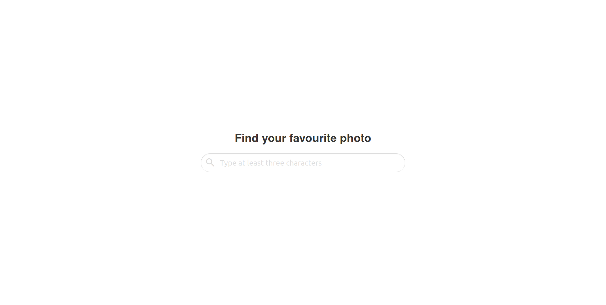
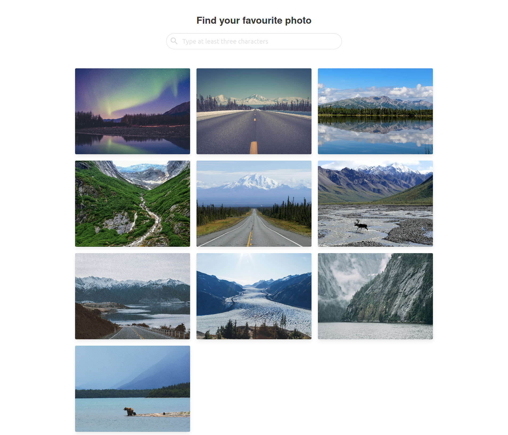

# Photo Search app

A simple application for searching photos using api - unsplash.

## Installation

### Client
Use the package manager [npm](https://www.npmjs.com/).

Install the dependencies
```bash
npm install
```
Run your client
```bash
npm run dev
```
Open your browser: [http://localhost:8080](http://localhost:8080)

### Server
Use the package manager [npm](https://www.npmjs.com/).

Install the dependencies
```bash
npm install
```
Create .env file and add your api key

Run your server
```bash
npm run dev
```
Open your browser: [http://localhost:8080](http://localhost:8080)

# Screenshots
<p align="center">
  
  
</p>

## License
[MIT](https://choosealicense.com/licenses/mit/)
